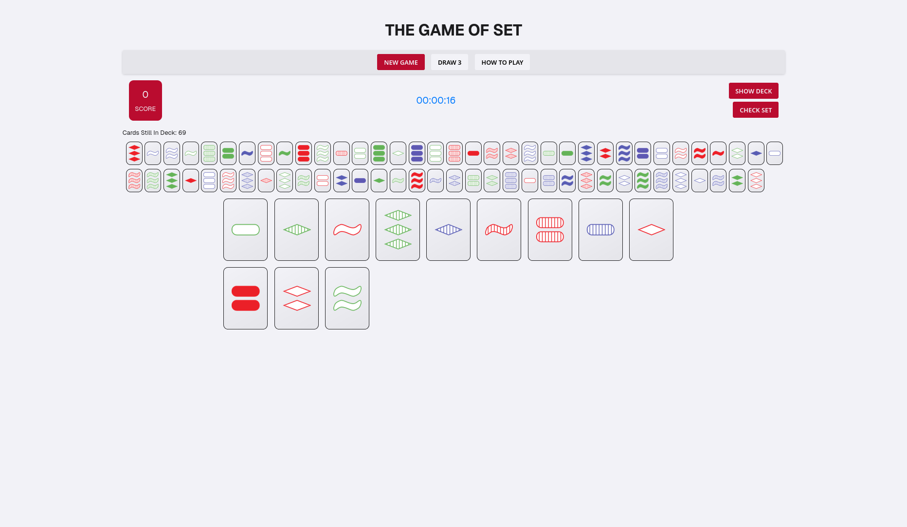

# CSE 3901 - Software Engineering in Ruby

This repository contains multiple projects developed for CSE 3901, a comprehensive software engineering course focusing on Ruby and web development technologies. Each project demonstrates different aspects of software development, from command-line applications to full-stack web applications.

## Project Overview

### 1. **Presentation Evaluation System** (`proj/`)
A comprehensive Ruby on Rails web application for managing and evaluating student presentations in academic courses.

**Technologies**: Ruby on Rails 7.x, PostgreSQL, HTML/ERB, CSS, JavaScript (Stimulus), Devise, Pundit  
**Features**:
- Multi-role user authentication (Students, Instructors, TAs).
- Course management and enrollment system.
- Presentation scheduling and organization.
- Comprehensive evaluation and grading system.
- Role-based dashboards and access control.

**Getting Started**:
```bash
cd proj/
bundle install
yarn install
rails db:create db:migrate
rails server
```

### 2. **Faculty Website Redesign** (`site_redesign/`)
A modern, responsive faculty website built with Middleman static site generator.


*Main faculty page featuring contact information, biography, and publications*

**Technologies**: Ruby, Middleman, SCSS, HTML5, ERB templating.
**Features**:
- Responsive design optimized for all devices.
- Faculty research showcase.
- Publications management via YAML data.
- Clean, professional UI with Ohio State University branding.
- Static site generation for optimal performance.

**Getting Started**:
```bash
cd site_redesign/
bundle install
middleman server
```


*About page with detailed faculty information*


*Faculty and research directory page*

### 3. **The Game of Set** (`the_game_of_set/`)
A Ruby command-line implementation of the classic Set card game with object-oriented design.

**Technologies**: Ruby, Object-Oriented Programming  
**Features**:
- Complete Set card game logic.
- Card class with shape, color, fill, and count attributes.
- Deck management and shuffling.
- Set validation and scoring.
- Interactive command-line interface.

**Getting Started**:
```bash
cd the_game_of_set/
bundle install
ruby src/game.rb
```

### 4. **The Game of Set Revisited** (`the_game_of_set_revisited/`)
A modern web-based version of the Set card game with interactive JavaScript gameplay.


*Main game interface showing 12 face-up cards, controls, and score display*

**Technologies**: Vanilla JavaScript, HTML5, CSS3, DOM manipulation.
**Features**:
- Interactive web-based game interface.
- Visual card representations with sprites.
- Real-time set validation.
- Local storage for game state persistence.
- Responsive design for various screen sizes.
- Component-based JavaScript architecture.

**Getting Started**:
```bash
cd the_game_of_set_revisited/
npm install
npm start
```


*Game interface during play with card selection and set identification*


*Additional features including draw pile, timer, and statistics*

### 5. **Lecture Slides** (`lec_slides/`)
Course lecture materials covering various software engineering topics.

**Content**: PDF slides covering Ruby programming, web development, software engineering principles, and project management techniques.

## Learning Objectives

Throughout these projects, the following software engineering concepts are demonstrated:

- **Object-Oriented Programming**: Proper class design, encapsulation, and inheritance.
- **Web Development**: Full-stack development with Ruby on Rails.
- **Database Design**: Relational database modeling and PostgreSQL integration.
- **Authentication & Authorization**: User management and role-based access control.
- **Frontend Development**: Both server-side rendering and client-side JavaScript.
- **Static Site Generation**: Modern web development with build tools.
- **Testing**: Comprehensive test suites and quality assurance.
- **Version Control**: Git workflow and collaborative development.
- **Code Organization**: Proper project structure and separation of concerns.

## Course Structure

The projects progress in complexity:

1. **Simple Ruby Game** → Object-oriented programming fundamentals.
2. **Static Website** → Web development basics and build tools.
3. **Interactive JavaScript Game** → Client-side programming and DOM manipulation.
4. **Full Rails Application** → Complete web application development.

## Development Tools

- **Ruby**: Primary programming language.
- **Rails**: Web application framework.
- **PostgreSQL**: Database management system.
- **Git**: Version control.
- **Bundler**: Ruby dependency management.
- **Yarn/NPM**: JavaScript package management.
- **Middleman**: Static site generator.

## Documentation

Each project contains detailed documentation including:
- Setup and installation instructions.
- Architecture and design decisions.
- API documentation (where applicable).
- Testing guidelines.
- Deployment instructions.

## Contributing

This repository represents coursework for CSE 3901. Each project follows specific requirements and demonstrates particular learning objectives within the software engineering curriculum.

## License

These projects are developed for educational purposes as part of The Ohio State University's CSE 3901 course curriculum.
