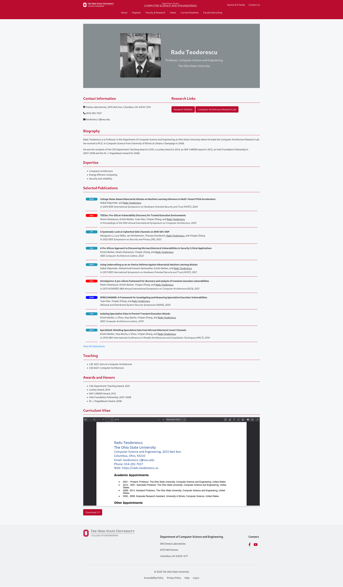

# Project 2: Faculty Page Redesign for Radu Teodorescu

## Introduction

This project is a redesign of the faculty page for Radu Teodorescu, a current faculty member at The Ohio State University's Department of Computer Science and Engineering. The site is built using Middleman, a static site generator.

## Project Structure

The project follows a standard Middleman structure:

- `source/`: Contains all source files.
- `config.rb`: Middleman configuration file.
- `Gemfile`: Ruby dependencies.

The project follows a standard Middleman setup. The main files to focus on are:

- `source/layouts/layout.erb`: This file contains the main layout structure for all pages.
- `source/index.html.erb`: This is the main content for the homepage.
- `source/about.html.erb`: This file contains the main content for the _about_ page.
- `source/faculty-research.html.erb`: This file contains the main content for the _faculty and research_ page.
- `source/news.html.erb`: This file contains the main content for the _news_ page.
- `source/stylesheets/site.css.scss`: This file contains all the styles for the site.
- `source/javascripts/site.js`: This file contains the JavaScript for interactive elements on the site.

## How to Run

1. Ensure you have Ruby installed on your system.
2. Install Bundler if you haven't already:

   ```{sh}
   gem install bundler
   ```

3. Clone this repository and navigate to the project directory.
4. Install dependencies:

   ```{sh}
   bundle install
   ```

5. Start the Middleman server:

   ```{sh}
   bundle exec middleman server
   ```

6. Open your browser and go to `http://localhost:4567` to view the site.

## Building for Production

To build the static site for production:

```{sh}
bundle exec middleman build
```

This will create a `build` directory with your static site files.

## Site Screenshots

The following images showcase the redesigned faculty page:

### Main Faculty Page

*The main faculty page featuring Radu Teodorescu's profile with contact information, biography, expertise, selected publications, and curriculum vitae.*

### About Page

*The about page providing detailed information about Professor Teodorescu's background, research interests, and academic experience.*

### Faculty Directory

*The faculty and research page displaying multiple faculty members from the Department of Computer Science and Engineering.*

## TODO

- [ ] Optimize images and assets.
- [ ] Implement accessibility improvements.
- [ ] Cross-browser testing.
- [ ] Mobile responsiveness testing.
