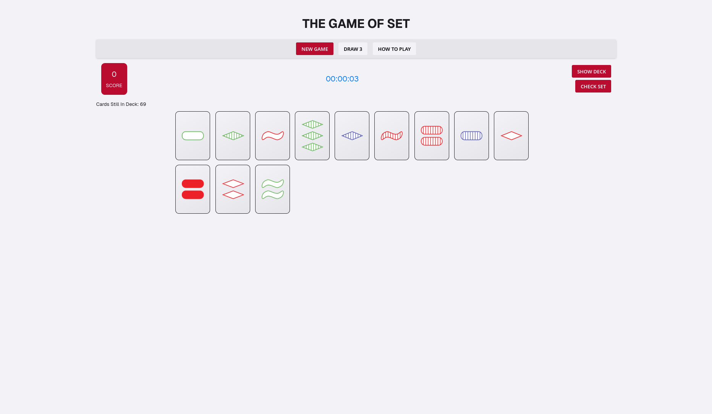
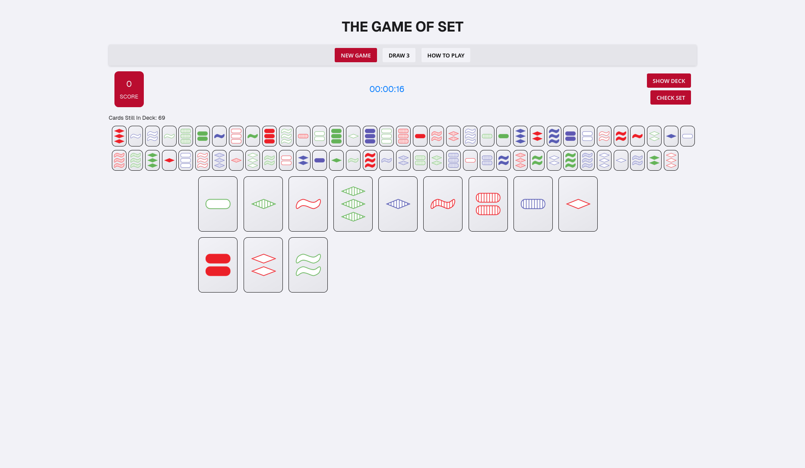
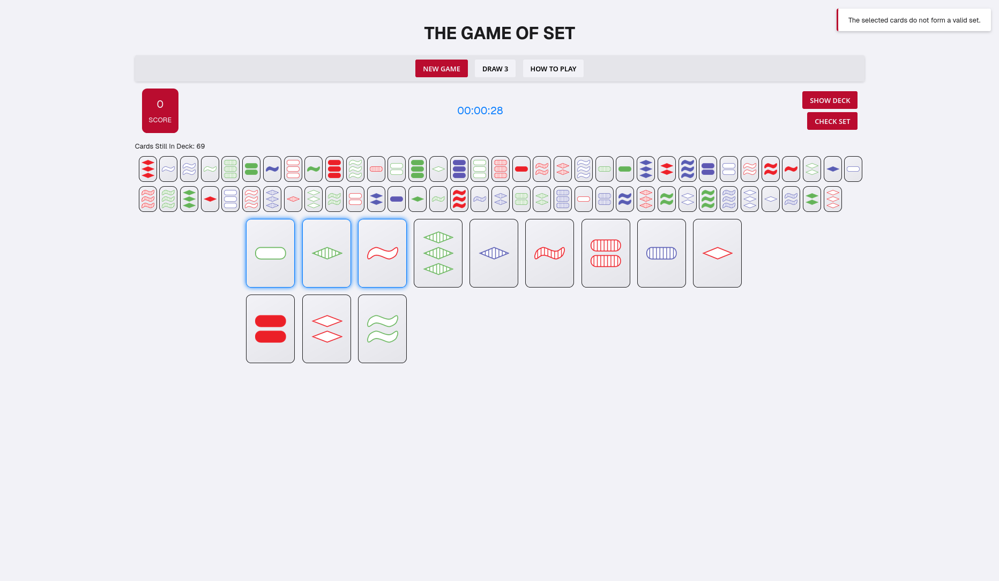

## The Game of Set

### Description

In this project, I implement [_The Game of Set_](<https://en.wikipedia.org/wiki/Set_(card_game)>), which is commonly referred to as _Set_ (stylized as **_SET_** or **_SET!_**). It is a real-time card game in which players attempt to find a group of cards that satisfy a particular criterion. The deck consists of 81 unique cards that vary in four features across three possibilities for each kind of feature: `number of shapes` (one, two, or three), `shape` (diamond, squiggle, or oval), `shading` (solid, striped, or open), and `color` (red, green, or purple). _Set_ is a speed game: 12 cards are dealt face-up, and the players try to be the first to make a "set" from the visible cards, which means that for each one of the four categories of features - `number of shapes`, `shape`, `shading`, and `color` - the three cards must display that feature as either **a.) all the same**, or **b.) all different**. In other words, for each feature, the three cards must _avoid_ having two cards showing one version of the feature and the remaining card showing a different version.

## Game Rules

The Game of Set is a real-time card game where players compete to identify "sets" of three cards from 12 face-up cards. The game continues until no more sets can be formed.

### Card Features
Each card has four features:
1. **Number of Shapes**: one, two, or three.
2. **Shape Type**: diamond, squiggle, or oval.
3. **Shading**: solid, striped, or open.
4. **Color**: red, green, or purple.

### What Makes a Set?
A valid set consists of three cards where each feature is either:
- **ALL THE SAME** across all three cards, OR
- **ALL DIFFERENT** across all three cards.

For example:
- Three cards with all different colors (red, green, purple) is valid.
- Three cards with all the same color (all red) is valid.
- Two red cards and one green card is NOT valid.

### Gameplay
1. **Setup**
   - 12 cards are dealt face-up.
   - Remaining cards form the draw pile.

2. **Finding Sets**
   - Players look for sets among the face-up cards.
   - Click three cards to select them.
   - Click "Check Set" to verify if they form a valid set.

3. **After Finding a Set**
   - Valid sets are removed from play.
   - Three new cards are dealt from the draw pile.
   - Player's score increases by 1.

4. **Special Actions**
   - "Draw 3" adds three more cards if no sets are visible.
   - "Show Deck" displays remaining cards in the draw pile.

5. **Game End**
   - Game ends when no more sets can be formed.
   - Final score and time are displayed.

### Scoring
- +1 point for each valid set found.
- No penalty for incorrect sets.
- Timer tracks game duration.

### Examples of Valid Sets
1. Three cards with:
   - All different numbers (1, 2, 3).
   - All different shapes (diamond, squiggle, oval).
   - All different shadings (solid, striped, open).
   - All same color (all red).

2. Three cards with:
   - All same number (all 2).
   - All same shape (all diamonds).
   - All same shading (all solid).
   - All different colors (red, green, purple).

### Tips
- Look for patterns in the features.
- Check each feature independently.
- Remember: each feature must be either all same or all different.
- Use the "Draw 3" option if stuck.

## Setup and Running

### Prerequisites

- Node.js (v12 or higher)
- npm (comes with Node.js)

### Installation

1. Clone the repository:

```bash
git clone https://github.com/danny-kn/cse_3901.git
cd the_game_of_set_revisited/
```

2. Install dependencies:

```bash
npm install
```

3. Start the development server:

```bash
npm start
```

4. Open your browser and navigate to:

```
http://localhost:8080
```

### Important Notes

- Make sure you have the sprites directory with all required card images.
- The game requires a modern browser with ES modules support.

## Game Screenshots

The following images showcase the Set card game implementation:

### Game Interface

*The main game interface showing the 12 face-up cards, game controls, and score display.*

### Game in Progress

*The game interface during play, demonstrating card selection and set identification.*

### Game Features

*Additional game features including the draw pile, timer, and game statistics.*
